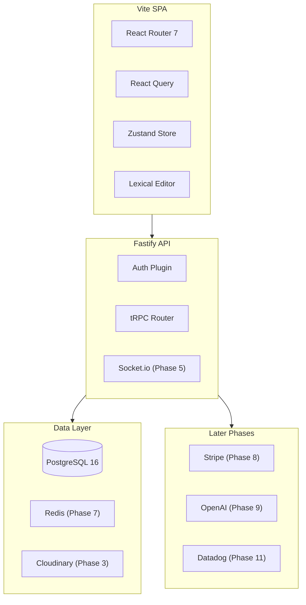

# Senior Full Stack Developer Roadmap via Folio

## The Core Problem to Solve

The feedback was specific: **guidance-dependent coding**, **limited debugging depth**, and **shallow analytical thinking**. Every phase below forces you to design first, debug independently, and explain the "why" behind every decision — exactly what interviewers probe for.

## The App: Folio

A literary workshop and publishing platform. Think "GitHub for writers" meets MFA workshop culture. You already know this domain — you've built versions of it — which gives you a real product advantage: you'll make better architectural decisions because you understand the user deeply.

**Core features:**

- Writers create or join **Workshops** (the multi-tenant root — each workshop has its own members, rules, and deadlines)
- Works (poems, essays, stories) move through a **submission pipeline**: draft → submitted → open for critique → workshop session → revised → published
- **Anonymous critique system**: inline text annotations at character-level ranges, threaded comment discussions, anonymous identity revealed only after the round closes
- **Real-time workshop sessions**: multiple readers annotate the same piece simultaneously, presence indicators, live annotation broadcasting
- **Publishing**: writers publish polished work publicly
- Email notifications, in-app notification center

**Planned additions (later phases):** Redis + BullMQ, Stripe paid subscriptions, OpenAI developmental editor, Datadog APM.

**Tech stack:**

|                | Now                                                                   | Later                       |
| -------------- | --------------------------------------------------------------------- | --------------------------- |
| Frontend       | Vite + React 19 + TypeScript + React Query + Zustand + React Router 7 | —                           |
| Rich text      | Lexical (MIT, Meta-maintained)                                        | —                           |
| Backend        | Node.js + Fastify + TypeScript + tRPC 11                              | —                           |
| ORM            | Prisma 6                                                              | —                           |
| DB             | PostgreSQL 16                                                         | pgvector (Phase 9)          |
| Cache / Queues | —                                                                     | Redis + BullMQ (Phase 7)    |
| Real-time      | —                                                                     | Socket.io (Phase 5)         |
| Storage        | —                                                                     | Cloudinary (Phase 3)        |
| Payments       | —                                                                     | Stripe (Phase 8)            |
| Email          | —                                                                     | Resend (Phase 6)            |
| AI             | —                                                                     | OpenAI SDK (Phase 9)        |
| Testing        | Vitest + React Testing Library + Playwright                           | —                           |
| Monitoring     | —                                                                     | Datadog APM (Phase 11)      |
| Infra          | Docker Compose (PostgreSQL only)                                      | GitHub Actions CI + Railway |

---

## Architecture Overview

---

## Database Schema (current tables)

- `users` — identity, profile
- `refresh_tokens` — JWT refresh token records
- `workshops` — the multi-tenant root (literary workshops, classrooms, writing groups)
- `memberships` — user × workshop × role (owner, moderator, member)
- `invites` — signed email invite tokens
- `works` — title, genre, tags, state, author, workshop
- `work_versions` — append-only version history per work (Lexical JSON state)
- `critique_rounds` — open/close/reveal timestamps, anonymity flag
- `annotations` — character offset ranges, pseudonym, quote snapshot
- `annotation_threads` — threaded replies on an annotation
- `annotation_endorsements` — upvotes (unique constraint prevents duplicates)
- `publications` — published works (public)
- `notifications` — polymorphic notification records

**Added later:** `subscriptions` (Phase 8), `ai_analyses` + `work_embeddings` (Phase 9)

---

## Timeline: 28 Weeks (~7 months, 4 evenings/week × 2h)

### Phase 1 — Architecture & Foundation (Weeks 1–3, ~24h) ✅ COMPLETE

**Goal:** Make design decisions like a senior engineer. Document the WHY.

- ✅ Monorepo (`pnpm workspaces`: `apps/web`, `apps/api`, `packages/shared`, `packages/db`)
- ✅ Full Prisma schema (all current tables, relations, indexes)
- ✅ 7 ADRs: Vite SPA, Fastify, Lexical, Prisma, tRPC, Zustand, row-level multi-tenancy
- ✅ Docker Compose (PostgreSQL 16 only)
- ✅ ESLint flat config with per-environment globals, Prettier, Husky pre-commit hook
- ✅ Shared Zod schemas package, TypeScript strict mode across all packages
- ✅ Dev auth bypass (`X-Dev-User-Id` header, non-production only)

**Interview prep:** "Design a collaborative writing platform." Draw the ERD. Explain why `annotations` stores character offsets instead of line numbers. Explain multi-tenancy trade-offs (row-level vs. schema-per-tenant).

---

### Phase 2 — Auth & Multi-tenancy (Weeks 4–5, ~16h) 🔄 IN PROGRESS

**Goal:** Build auth from scratch, own every token lifecycle and access control decision.

- ✅ JWT access tokens (15min TTL) + refresh tokens (7d, httpOnly cookie, stored in DB)
- ❌ Google OAuth via Passport.js
- ✅ Workshop-scoped RBAC: `workshopProcedure` + `membership.service`; workshop CRUD router with role matrix (get: all members, update: owner/moderator, delete: owner); `WorkshopSchema` outputs + `NOT_FOUND` / `CONFLICT` errors
- ❌ Workshop invite system: signed short-lived tokens redeemed on registration (emails sent manually for now — Resend added in Phase 6) _(schema + `InviteMemberInputSchema` only)_
- ✅ Password hashing with Argon2 (timing-safe, memory-hard — preferred over bcrypt)
- ❌ Frontend: protected routes, `useAuth` hook, token refresh interceptor in React Query _(Zustand `auth.store` only — no login/register pages, no Bearer header, no silent refresh)_
- ❌ Remove dev bypass once real auth is in place _(still active in `context.ts` + README)_

**Interview prep:** "Explain how refresh tokens work and how you'd revoke them." Whiteboard the full token lifecycle — issuance, silent refresh, revocation on logout, revocation on password change. "How would you implement row-level security for a multi-tenant app?"

---

### Phase 3 — Works, Editor & Search (Weeks 6–8, ~24h)

**Goal:** Advanced PostgreSQL, event sourcing for versioning, complex controlled components, custom Lexical plugins.

- Integrate Lexical with a custom annotation plugin: `DecoratorNode` that wraps annotated text ranges and stores annotation IDs as node metadata
- Draft management with append-only `work_versions` table — every save is a new version (event sourcing pattern, not mutable update)
- Auto-save with debounce via `LexicalOnChangePlugin`, conflict detection if the same draft is open in two tabs (broadcast channel API)
- Full-text search on work titles and content with `pg_trgm` and GIN indexes
- Genre/tag filtering with array column and GIN index
- Cloudinary upload for cover images: WebP transform, responsive srcset
- Reading view: typography-focused layout, estimated read time calculation
- Infinite scroll with React Query `useInfiniteQuery` (cursor-based, not offset)

**Interview prep:** "What is event sourcing and when would you use it?" and "How do you optimize a slow PostgreSQL full-text search query?" Be able to explain `EXPLAIN ANALYZE`, B-tree vs. GIN index, and why `pg_trgm` helps with partial matches. Also: "How would you handle two browser tabs editing the same document?" (BroadcastChannel API for tab coordination, or optimistic lock via version number).

---

### Phase 4 — Critique Pipeline & Annotation System (Weeks 9–11, ~24h)

**Goal:** Domain-Driven Design, complex state machines, transactional integrity, race conditions.

- Work submission state machine with XState:
  `draft → submitted → critique_open → session → reveal → revised → published`
  with `withdrawn` and `rejected` branches
- Inline annotation system: `{ start, end, workVersionId }` character offsets in PostgreSQL, resolved to Lexical `DecoratorNode` ranges on the frontend
- Anonymous critique mode: `annotations.authorId` hidden behind a per-round pseudonym until `critique_rounds.revealAt` passes (DB scheduled check — background jobs come in Phase 7)
- Threaded replies on annotations with optimistic updates and rollback
- Endorsement/upvote system on annotations (unique constraint prevents duplicate votes at DB level)

**Interview prep:** "How do you handle a race condition where two users submit to the last open critique slot simultaneously?" (DB-level advisory locks or optimistic locking with version columns). "What's cursor-based pagination and why prefer it over offset?"

---

### Phase 5 — Real-time Workshop Sessions (Weeks 12–13, ~16h)

**Goal:** WebSockets, event-driven architecture, presence, optimistic UI with rollback.

- Socket.io rooms scoped to `work × critique_round`
- Presence system: who is currently reading a piece (in-memory on single instance for now — Redis adapter added in Phase 7)
- Live annotation broadcasting: all readers in the room see new annotations in real-time
- Optimistic annotation creation with rollback on API failure
- Reconnection logic: client queues mutations made while offline, replays on reconnect
- Custom React hook: `useWorkshopSession(workId, roundId)`

**Interview prep:** "How does the WebSocket handshake differ from HTTP?" and "How would you scale WebSocket connections across multiple Node.js instances?" Be able to explain the Redis pub/sub adapter pattern — this is a classic senior architecture question.

---

### Phase 6 — Publishing & Notifications (Weeks 14–15, ~16h)

**Goal:** Third-party email integration, polymorphic notifications, transactional integrity.

- Writers publish polished works publicly from the `revised` state
- In-app notification center: polymorphic `notifications` table, mark-all-read with a single DB update
- Transactional emails via Resend: critique round opened, work published, annotation reply
- Invite email: send the workshop invite token via Resend (replaces the manual flow from Phase 2)

**Interview prep:** "How do you design a polymorphic notifications table?" and "How do you ensure an email is sent exactly once even if a server restarts mid-request?" (idempotency key, DB flag before send, background retry — foreshadows Phase 7 queues).

---

### Phase 7 — Redis + BullMQ (Weeks 16–17, ~16h)

**Goal:** Understand caching, queuing, and background job patterns that appear in nearly every senior interview.

- Add Redis to Docker Compose
- Rate limiting (Redis sliding window) on all auth and mutation endpoints
- Session/notification unread count caching in Redis (set on write, invalidate on mark-read)
- BullMQ queues: deadline reminders 24h before critique round closes, auto-close rounds at deadline, weekly digest email
- Redis pub/sub Socket.io adapter (upgrade Phase 5 presence to work across multiple API instances)

**Interview prep:** "When would you use Redis over PostgreSQL for storing state?" and "How do you prevent duplicate background job execution?" (idempotency keys, `SETNX`, BullMQ's built-in deduplication). These are among the most common senior backend interview questions.

---

### Phase 8 — Stripe Subscriptions (Weeks 18–19, ~16h)

**Goal:** Third-party billing integration, webhook idempotency, access control based on payment state.

- Stripe Subscriptions: paid writer tiers (e.g., premium workshop seats)
- Subscriber-only content gating on publication routes
- Stripe webhook handler with idempotency key verification (handle duplicate events gracefully)
- `subscription.status` propagated to DB on every webhook event

**Interview prep:** "What is idempotency and why does it matter in webhook handlers?" and "How would you prevent a subscriber from accessing paid content after their subscription lapses?" (webhook → update DB → middleware checks `subscription.status`).

---

### Phase 9 — AI Developmental Editor (Weeks 20–22, ~24h)

**Goal:** Product-valuable AI that a hiring manager immediately understands.

- Add `pgvector` extension; generate `text-embedding-3-large` embeddings for published works
- Surface the 5 most similar works in the workshop as reference (cosine similarity with `<=>`)
- GPT-4o structural analysis: pacing arc, POV consistency, scene vs. summary balance — stored as structured JSON in `ai_analyses`, displayed as "manuscript health" panel
- AI first-pass critique: 3–5 inline annotation suggestions before human round opens
- Streaming assistant via Server-Sent Events + RAG (workshop guidelines + writer's own history as context)
- Cost controls: Redis prompt cache (hash input), `max_tokens` caps, per-user daily token budget

**Interview prep:** "What is RAG and when would you use it over fine-tuning?" and "How do you prevent AI features from becoming a runaway cost in production?"

---

### Phase 10 — Testing (Weeks 23–25, ~24h)

**Goal:** Write tests like a senior — test behavior, not implementation.

- Unit tests (Vitest): state machine transitions, annotation offset calculations
- Custom hook tests with `renderHook` and `act`
- Integration tests: Fastify test client + isolated test DB (each test wrapped in a transaction, rolled back after)
- Zod schema contract tests: API responses validated against shared schemas automatically
- E2E (Playwright): register → create workshop → submit work → annotate → publish
- 80%+ coverage on domain logic; explicitly skip trivial pass-through code

**Interview prep:** "What's the difference between a unit test, integration test, and E2E test?" and "How do you test a function that calls the OpenAI API?" (mock the SDK client, assert the prompt structure, not the AI response).

---

### Phase 11 — Datadog, Performance & DevOps (Weeks 26–28, ~16h)

**Goal:** Production-grade observability — the clearest signal of senior thinking.

- **Datadog APM:** instrument Fastify with `dd-trace`, trace propagation from HTTP → DB → Redis → OpenAI
- **Custom metrics:** works submitted per day, critique engagement rate, AI token usage per user, Socket.io connection count
- **Datadog dashboard + alerts:** p99 API latency alert, error rate spike, AI cost per day threshold
- React performance: profile with React DevTools Profiler before touching `memo`/`useMemo`
- Bundle analysis with `rollup-plugin-visualizer`, route-level code splitting (lazy load Lexical editor)
- DB connection pooling with PgBouncer in Docker Compose
- Structured logging (Pino) with Datadog log correlation (`dd.trace_id` in every log line)
- GitHub Actions CI: lint → typecheck → test → build → Docker push → deploy to Railway
- Write a `RUNBOOK.md`: what to check when the app is down

**Interview prep:** "How would you debug a performance regression you can't reproduce locally?" Describe: Datadog APM → slow trace → slow span → `EXPLAIN ANALYZE` → index or cache → deploy → verify.

---

## Parallel Morning Track (YDKJS)

Align chapters to phases so the concepts reinforce what you're building that week:

- Weeks 1–5: Scope, closures, `this` — directly improves debugging annotation callbacks and event handlers
- Weeks 6–10: Prototypes, classes — understand how Lexical extensions and React internals work
- Weeks 11–19: Async/await, event loop — critical for understanding Node.js queue processing, Socket.io, and Redis
- Weeks 20–28: Types & Grammar, ES6+ — TypeScript confidence for the AI and testing phases

---

## Interview Readiness Checkpoints

**After Phase 4 (~week 11):** Live coding on state machines, DB transactions, race conditions — without guidance.

**After Phase 7 (~week 17):** System design interview on "Design a multi-tenant publishing platform with background jobs and real-time features." Redis, BullMQ, and Socket.io are all live by this point.

**After Phase 10 (~week 25):** Walk through test strategy, debugging process, and every architectural trade-off with full confidence.

**After Phase 11 (~week 28):** Portfolio-ready. You can open Datadog during an interview and show real production traces. That alone separates you from 90% of candidates.
